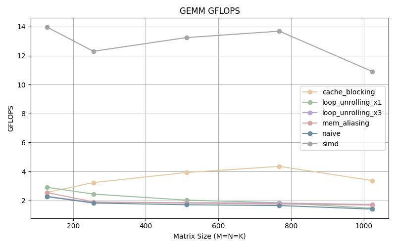
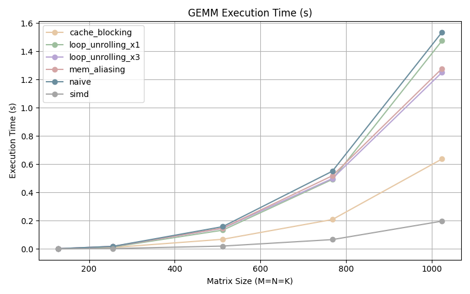

# Builiding a High Perforomance GEMM Kernel 

Accompanying write up : https://freth251.github.io/digital-garden/projects/tensor-opt-kernels/Building-a-High-Performance-GEMM-Kernel

Implementation of a GEMM kernel using various optimization techniques, such as `memory_aliasing`, `loop_unrolling`, `cache_blocking`, and `simd`. 

